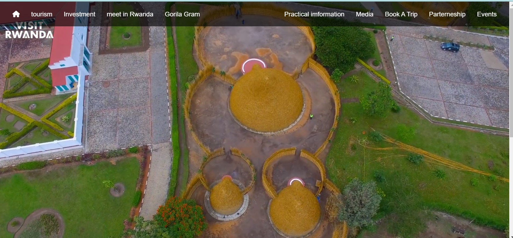
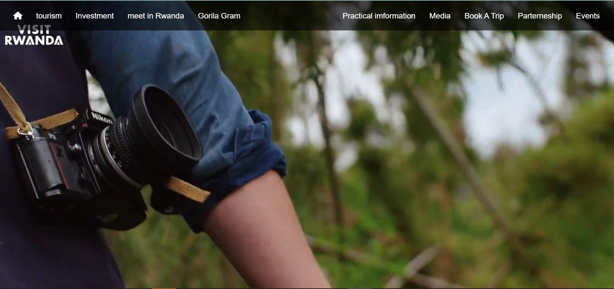
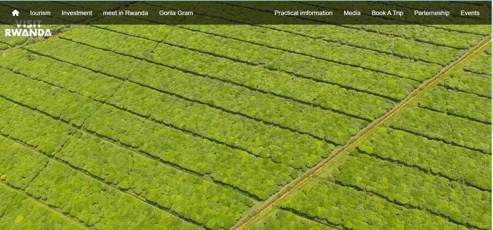

# Visit_Rwanda clone with HTML  and **CSS**
This project demonstrates a clone of Visit_Rwanda website  done with pure html and css ,js this repository is for educational purporse and people who are interested in fronted development and its easy understand the code used.

## Aurthor
**Christophe Gakwaya**
## screen shots of output
**Landing page view one**

**Landing page view one**

**Landing page view one**

## Usage
### Steps
1. clone Repository
   
   https://github.com/Gakwaya011/visit_rwanda_clone_with_html_css.git

2. Step Two
   
   cd visit_rwanda_clone_with_css Folder in your downloads folder

3. Step Three  
   
   open index.html in your browser

## Licence

   [MIT License](licence.md)

Feel Free to create Folks and don't hesitate to reach if encount an issue or idea.
## contact me
  EMAIL:c.gakwaya@alustudent.com

  PHONE:+250 780439155
## Happy Hacking ! !
  

